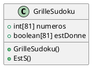

## UML : diagramme

```plantuml
@startuml
    class GrilleSudoku
    GrilleSudoku : +int[81] numeros
    GrilleSudoku : +boolean[81] estDonne
    GrilleSudoku : +GrilleSudoku()
    GrilleSudoku : +EstS()
@enduml
```