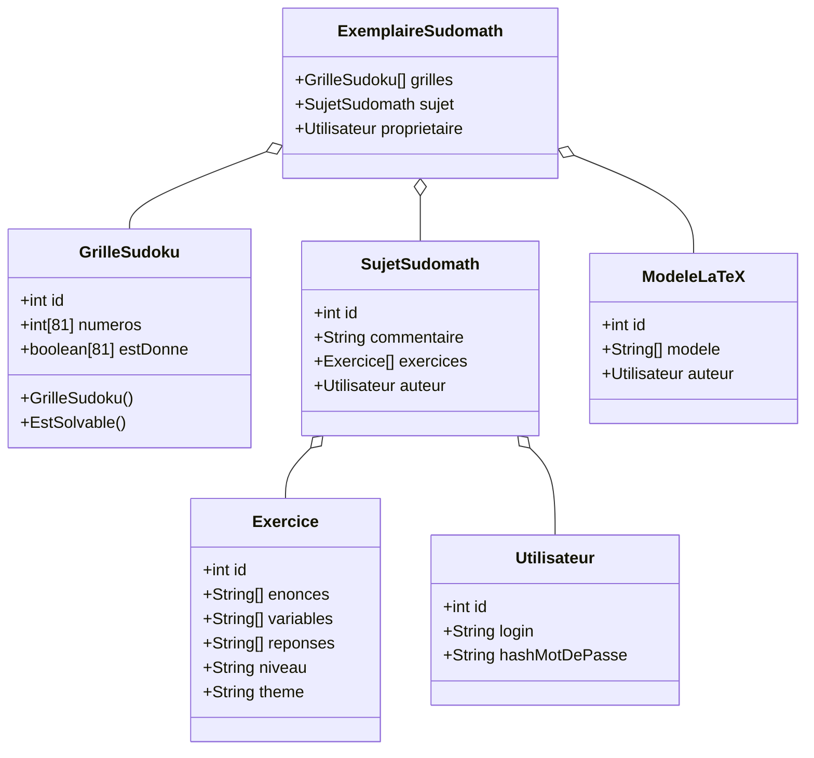

## Diagramme de classes

```mermaid
    classDiagram
    class GrilleSudoku
    GrilleSudoku : +int id
    GrilleSudoku : +int[81] numeros
    GrilleSudoku : +boolean[81] estDonne
    GrilleSudoku : +GrilleSudoku()
    GrilleSudoku : +EstSolvable()
    class SujetSudomath
    SujetSudomath : +int id
    SujetSudomath : +String commentaire
    SujetSudomath : +Exercice[] exercices
    SujetSudomath : +Utilisateur auteur
    class Exercice
    Exercice : +int id
    Exercice : +String[] enonces
    Exercice : +String[] variables
    Exercice : +String[] reponses
    Exercice : +String niveau
    Exercice : +String theme
    SujetSudomath o-- Exercice
    ExemplaireSudomath o-- ModeleLaTeX
    SujetSudomath o-- Utilisateur
    class Utilisateur
    Utilisateur : +int id
    Utilisateur : +String login
    Utilisateur : +String hashMotDePasse
    class ExemplaireSudomath
    ExemplaireSudomath : +GrilleSudoku[] grilles
    ExemplaireSudomath : +SujetSudomath sujet
    ExemplaireSudomath : +Utilisateur proprietaire
    ExemplaireSudomath o-- GrilleSudoku
    ExemplaireSudomath o-- SujetSudomath
    class ModeleLaTeX
    ModeleLaTeX : +int id
    ModeleLaTeX : +String[] modele
    ModeleLaTeX : +Utilisateur auteur


```
