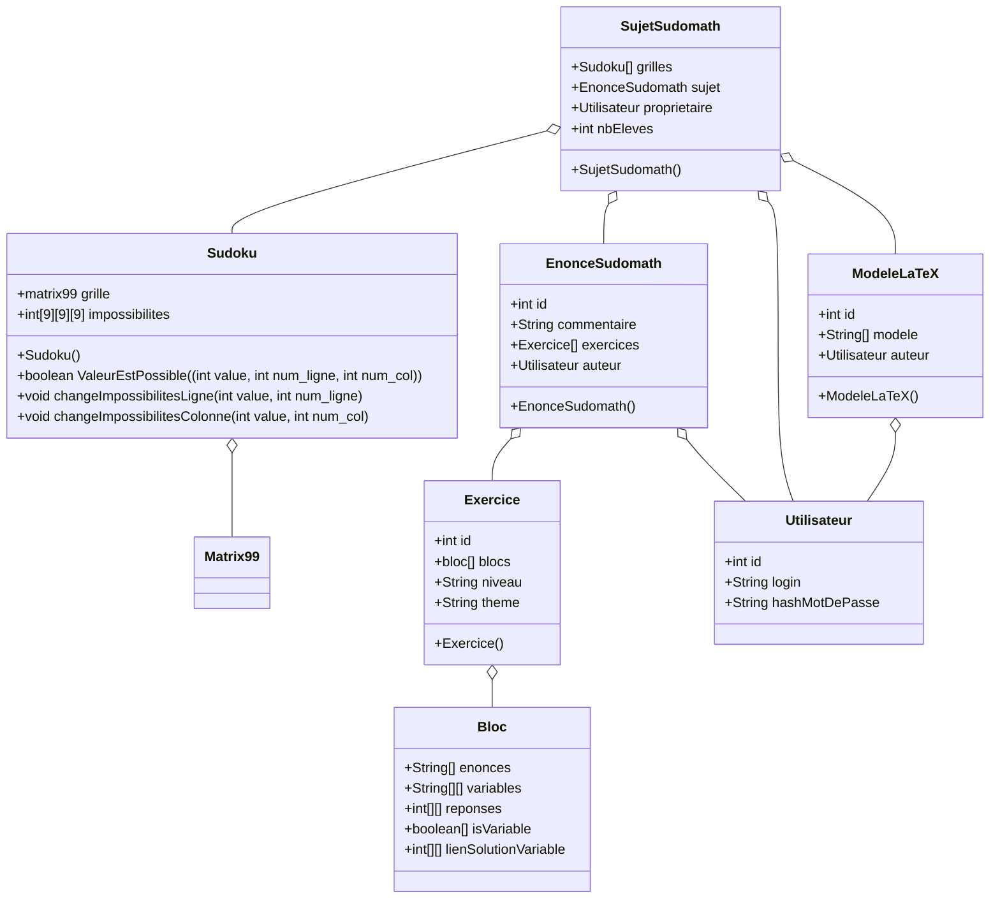
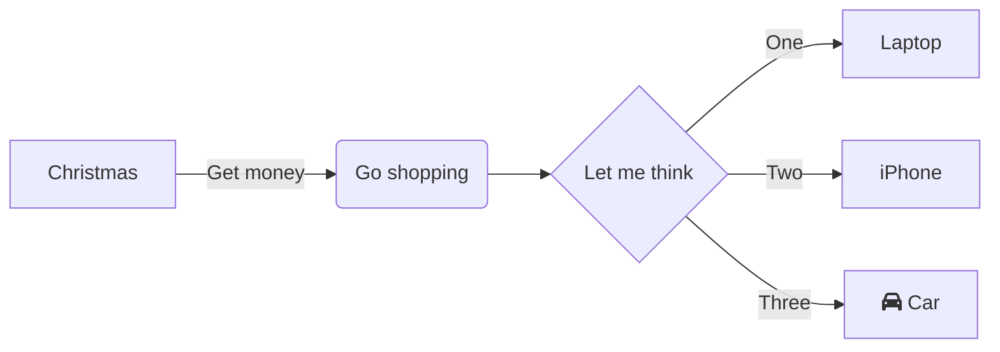

## Diagramme de classes

```mermaid
    classDiagram
    class Sudoku
    Sudoku : +matrix99 grille
    Sudoku : +int[9][9][9] impossibilites
    Sudoku : +Sudoku()
    Sudoku : +boolean ValeurEstPossible((int value, int num_ligne, int num_col))
    Sudoku : +void changeImpossibilitesLigne(int value, int num_ligne)
    Sudoku : +void changeImpossibilitesColonne(int value, int num_col)
    
    class Matrix99
    Sudoku o-- Matrix99
    class EnonceSudomath
    EnonceSudomath : +int id
    EnonceSudomath : +String commentaire
    EnonceSudomath : +Exercice[] exercices
    EnonceSudomath : +Utilisateur auteur
    EnonceSudomath : +EnonceSudomath()
    class Bloc
    Exercice o-- Bloc
    Bloc : +String[] enonces
    Bloc : +String[][] variables
    Bloc : +int[][] reponses
    Bloc : +boolean[] isVariable
    Bloc : +int[][] lienSolutionVariable
    class Exercice
    Exercice : +int id
    Exercice : +bloc[] blocs
    Exercice : +String niveau
    Exercice : +String theme
    Exercice : +Exercice()
    EnonceSudomath o-- Exercice
    SujetSudomath o-- ModeleLaTeX
    EnonceSudomath o-- Utilisateur
    class Utilisateur
    Utilisateur : +int id
    Utilisateur : +String login
    Utilisateur : +String hashMotDePasse
    class SujetSudomath
    SujetSudomath : +Sudoku[] grilles
    SujetSudomath : +EnonceSudomath sujet
    SujetSudomath : +Utilisateur proprietaire
    SujetSudomath : +int nbEleves
    SujetSudomath : +SujetSudomath()
    SujetSudomath o-- Sudoku
    SujetSudomath o-- EnonceSudomath
    SujetSudomath o-- Utilisateur
    class ModeleLaTeX
    ModeleLaTeX : +int id
    ModeleLaTeX : +String[] modele
    ModeleLaTeX : +Utilisateur auteur
    ModeleLaTeX : +ModeleLaTeX()
    ModeleLaTeX o-- Utilisateur

```

## Diagramme d'activité

```mermaid
graph LR
    A[Christmas] -->|Get money| B(Go shopping)
    B --> C{Let me think}
    C -->|One| D[Laptop]
    C -->|Two| E[iPhone]
    C -->|Three| F[fa:fa-car Car]

```
