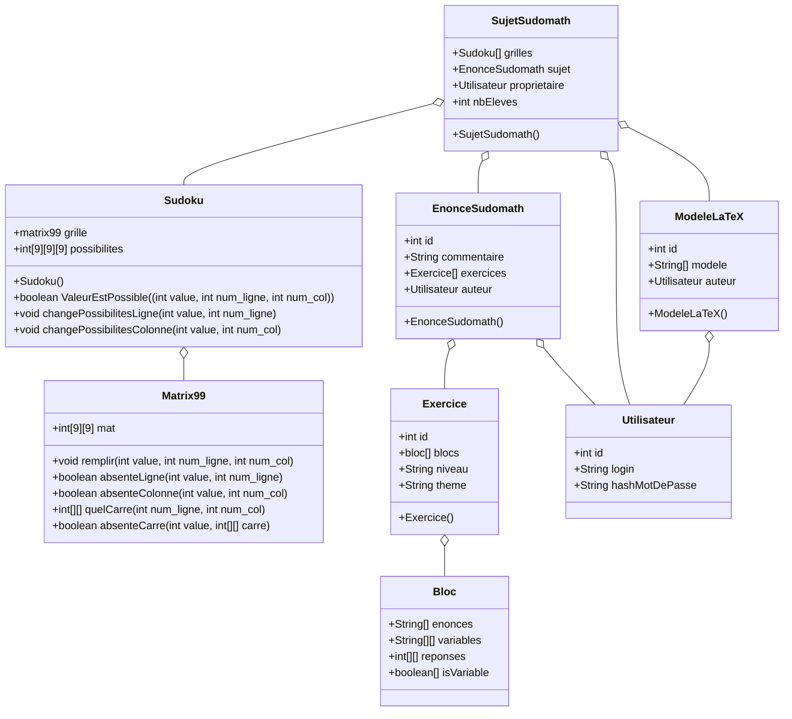
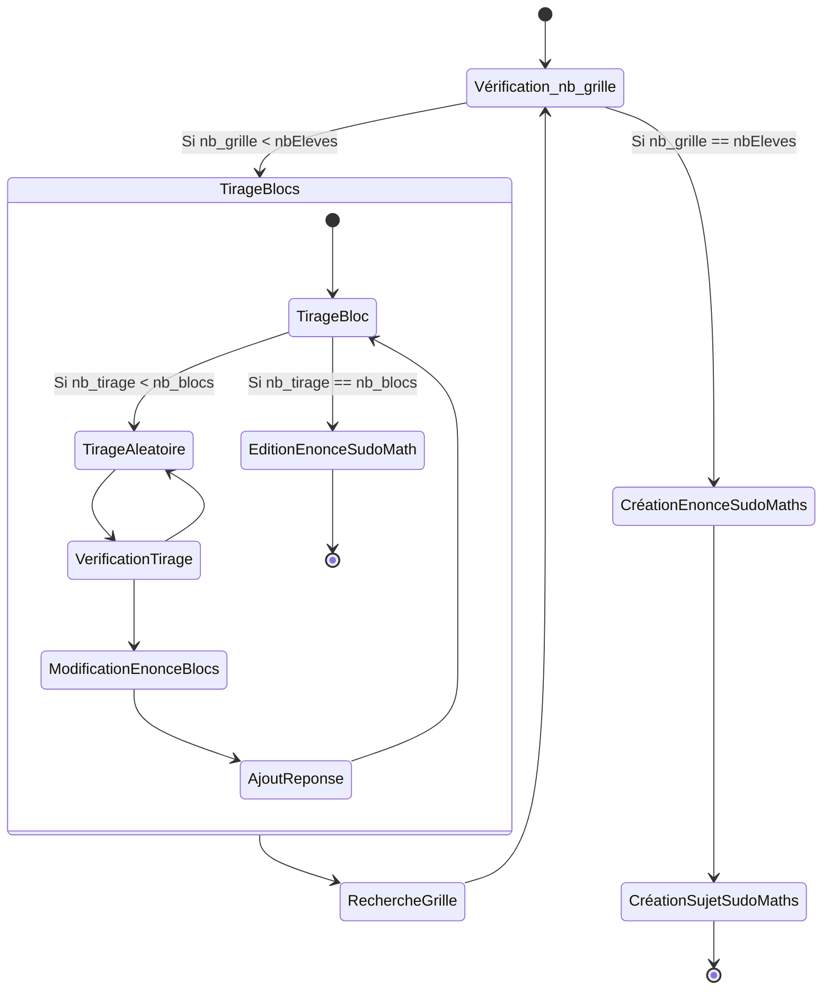

## Diagramme de classes

```mermaid
    classDiagram
    class Sudoku
    Sudoku : +matrix99 grille
    Sudoku : +int[9][9][9] possibilites
    Sudoku : +Sudoku()
    Sudoku : +boolean ValeurEstPossible((int value, int num_ligne, int num_col))
    Sudoku : +void changePossibilitesLigne(int value, int num_ligne)
    Sudoku : +void changePossibilitesColonne(int value, int num_col)
    
    class Matrix99
    Matrix99 : +int[9][9] mat
    Matrix99 : +void remplir(int value, int num_ligne, int num_col)
    Matrix99 : +boolean absenteLigne(int value, int num_ligne)
    Matrix99 : +boolean absenteColonne(int value, int num_col)
    Matrix99 : +int[][] quelCarre(int num_ligne, int num_col)
    Matrix99 : +boolean absenteCarre(int value, int[][] carre)
    Sudoku o-- Matrix99
    class EnonceSudomath
    EnonceSudomath : +int id
    EnonceSudomath : +String commentaire
    EnonceSudomath : +Exercice[] exercices
    EnonceSudomath : +Utilisateur auteur
    EnonceSudomath : +EnonceSudomath()
    class Bloc
    Exercice o-- Bloc
    Bloc : +String[] enonces
    Bloc : +String[][] variables
    Bloc : +int[][] reponses
    Bloc : +boolean[] isVariable
    class Exercice
    Exercice : +int id
    Exercice : +bloc[] blocs
    Exercice : +String niveau
    Exercice : +String theme
    Exercice : +Exercice()
    EnonceSudomath o-- Exercice
    SujetSudomath o-- ModeleLaTeX
    EnonceSudomath o-- Utilisateur
    class Utilisateur
    Utilisateur : +int id
    Utilisateur : +String login
    Utilisateur : +String hashMotDePasse
    class SujetSudomath
    SujetSudomath : +Sudoku[] grilles
    SujetSudomath : +EnonceSudomath sujet
    SujetSudomath : +Utilisateur proprietaire
    SujetSudomath : +int nbEleves
    SujetSudomath : +SujetSudomath()
    SujetSudomath o-- Sudoku
    SujetSudomath o-- EnonceSudomath
    SujetSudomath o-- Utilisateur
    class ModeleLaTeX
    ModeleLaTeX : +int id
    ModeleLaTeX : +String[] modele
    ModeleLaTeX : +Utilisateur auteur
    ModeleLaTeX : +ModeleLaTeX()
    ModeleLaTeX o-- Utilisateur

```

## Diagramme d'activité : Création d'un sujet SudoMath

```mermaid
stateDiagram-v2
    [*] --> Vérification_nb_grille
    Vérification_nb_grille --> TirageBlocs : Si nb_grille < nbEleves
    state TirageBlocs {
        [*] --> TirageBloc
        TirageBloc --> TirageAleatoire : Si nb_tirage < nb_blocs 
        TirageBloc --> EditionEnonceSudoMath : Si nb_tirage == nb_blocs 
        TirageAleatoire --> VerificationTirage
        VerificationTirage --> ModificationEnonceBlocs
        VerificationTirage --> TirageAleatoire 
        ModificationEnonceBlocs --> AjoutReponse
        AjoutReponse --> TirageBloc
        EditionEnonceSudoMath --> [*]
    }
    TirageBlocs --> RechercheGrille
    RechercheGrille --> Vérification_nb_grille
    Vérification_nb_grille --> CréationEnonceSudoMaths : Si nb_grille == nbEleves
    CréationEnonceSudoMaths --> CréationSujetSudoMaths
    CréationSujetSudoMaths --> [*]
```
